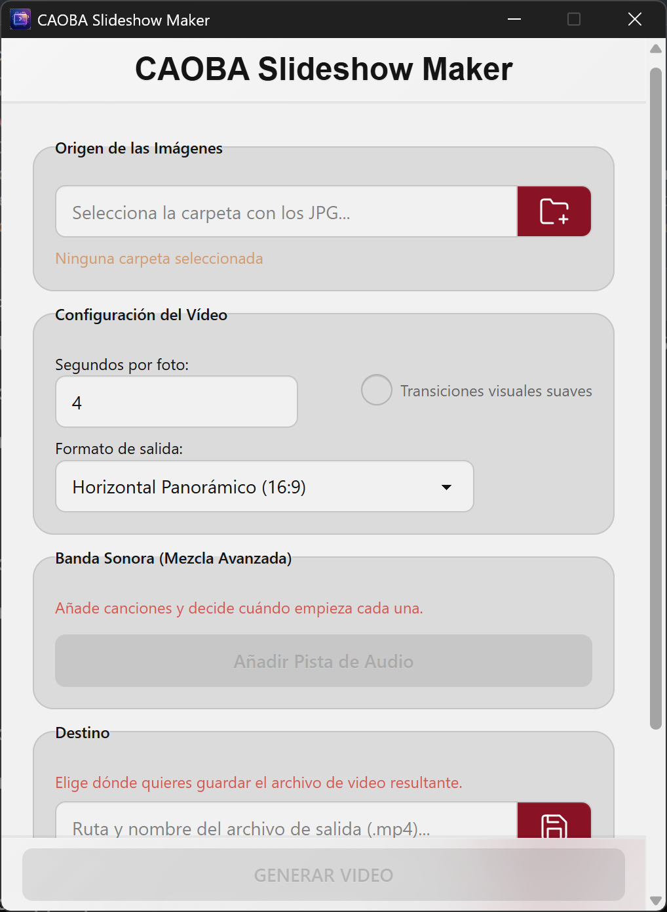

# 📸 CAOBA Slideshow Maker

> Una aplicación de escritorio potente y fácil de usar para crear videos a partir de fotos, construida con Electron y la potencia de FFmpeg.



## 📖 Descripción

CAOBA Slideshow Maker permite a los usuarios transformar una carpeta de imágenes JPG en un video profesional MP4. A diferencia de los generadores básicos, esta herramienta ofrece un control granular sobre la banda sonora, permitiendo múltiples pistas de audio con puntos de inicio personalizados y mezclas suaves.

Diseñada pensando en la versatilidad, permite exportar en varios formatos optimizados para redes sociales (vertical para Reels/TikTok, horizontal para YouTube, etc.).

El núcleo de la aplicación utiliza un motor inteligente que decide automáticamente entre un procesado rápido ("Modo Simple") para tareas básicas, o un procesado complejo ("Modo Avanzado" con `filter_complex` de FFmpeg) cuando se requieren transiciones o mezcla de audio precisa.

## ✨ Características Principales

* **Flujo de trabajo sencillo:** Selecciona una carpeta con imágenes JPG y listo.
* **Banda Sonora Multi-pista:**
    * Añade múltiples archivos MP3.
    * **Modo Automático:** Las canciones se reproducen secuencialmente con una disolvencia cruzada (crossfade) suave entre ellas.
    * **Modo Manual:** Decide exactamente en qué número de fotografía debe empezar una canción específica.
* **Transiciones Visuales:** Opción para activar disolvencias suaves (crossfade) entre fotografías.
* **Múltiples Formatos de Salida:**
    * Horizontal (16:9, 3:2, 5:4)
    * Vertical (9:16, 2:3, 4:5)
    * *La aplicación ajusta y rellena automáticamente las imágenes para encajar en el formato elegido sin deformarse.*
* **Experiencia de Usuario Robusta:**
    * Barra de progreso en tiempo real.
    * Botón para **Cancelar** el proceso de generación en cualquier momento.
    * Selección personalizada de la ruta y nombre del archivo de destino.
* **Modo Silencioso:** Capacidad para generar video sin ninguna pista de audio.

## 🛠️ Tecnologías Utilizadas

* [Electron](https://www.electronjs.org/) - Framework para la aplicación de escritorio.
* Node.js - Entorno de ejecución backend.
* HTML5 / CSS3 / JavaScript - Interfaz de usuario (Frontend).
* [FFmpeg](https://ffmpeg.org/) (vía `ffmpeg-static`) - El motor de procesamiento de video y audio.
* [ffprobe](https://ffmpeg.org/ffprobe.html) (vía `ffprobe-static`) - Para el análisis de duración de archivos de audio.
* `electron-builder` - Para empaquetar y distribuir la aplicación.

## 🚀 Instalación y Configuración (Desarrollo)

Si deseas ejecutar este proyecto localmente para desarrollo o modificación:

### Requisitos Previos
* Tener instalado [Node.js](https://nodejs.org/) (Versión LTS recomendada).
* Sistema operativo: Windows 10/11 o macOS.

### Pasos

1.  **Clonar o descargar** este repositorio.
2.  Abrir una terminal en la carpeta raíz del proyecto.
3.  **Instalar las dependencias:**
    ```bash
    npm install
    ```
    *Nota: Este paso puede tardar unos minutos, ya que descargará los binarios necesarios de FFmpeg y ffprobe para tu sistema operativo.*

### Ejecutar en modo desarrollo

Para iniciar la aplicación en modo de prueba con recarga en caliente (si está configurada) o logs en consola:

```bash
npm start
```

## 📦 Construcción y Empaquetado (Distribución)
Para generar los ejecutables finales (archivo .exe para Windows o .dmg/.app para macOS) listos para el usuario final:

```bash
npm run dist
```

Los archivos generados aparecerán en la carpeta dist/ dentro del proyecto.

Nota para Windows: Si compilas desde Windows, se generará el instalador .exe.

Nota para macOS: Si compilas desde macOS, se generarán .dmg y .app.

## ⚙️ Estructura del Proyecto
* main.js: Proceso principal de Electron. Maneja la creación de ventanas, la comunicación IPC y contiene toda la lógica compleja de generación de comandos FFmpeg, gestión de procesos hijos (spawn) y cálculo de tiempos de audio.

* renderer.js: Lógica del frontend. Maneja la interacción del usuario con el DOM (botones, inputs, lista dinámica de música) y envía solicitudes al proceso principal.

* preload.js: Puente de seguridad (Context Bridge) que expone APIs seguras y limitadas desde el proceso principal al renderer.

* index.html: La estructura visual de la interfaz de usuario.

* build/: Carpeta que contiene los iconos de la aplicación (icon.ico, icon.png, icon.icns).

## 📄 Licencia
GNU GENERAL PUBLIC LICENSE 3.0